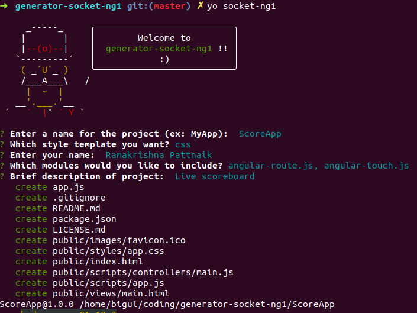
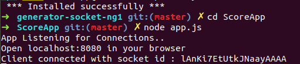
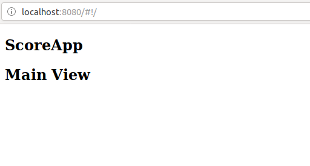

# generator-socket-ng1

Generates the boiler-plate code for using AngularJS client with Socket.io in the backend to develop realtime projects.

## Getting started.

First, install [Yeoman](http://yeoman.io) and generator-socket-ng1 using [npm](https://www.npmjs.com/) (we assume you have pre-installed [node.js](https://nodejs.org/)) - if you need to manage multiple versions of node also consider [nvm](https://github.com/creationix/nvm).

Once node is installed, run this in your terminal.


```bash
npm install -g yo generator-socket-ng1
```

Then generate your new project:

```bash
yo generator-socket-ng1
```

## Directory structure

```
  |
  |-->public
  |     |--> index.html
  |     |--> images
  |     |       |--> favicon.ico
  |     |--> scripts
  |     |       |--> app.js
  |     |       |--> controllers
  |     |       |--> services
  |     |--> styles
  |     |       |--> app.css
  |     |--> views
  |--> app.js
  |--> LICENSE.md
  |--> package.json
  |--> README.md
  |--> .gitignore
  
```

## Sample Usage 

### Running the generator



### Running the server of generated app



### Client app



## Build Setup

``` bash
# install dependencies
npm install

# run linting tests
npm run pretest

# run all tests
npm test
```

## License

MIT © [Ramkrishna Pattnaik](https://github.com/rkpattnaik780)